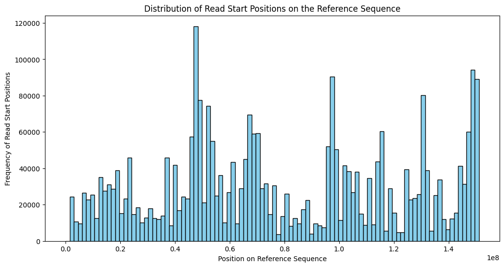
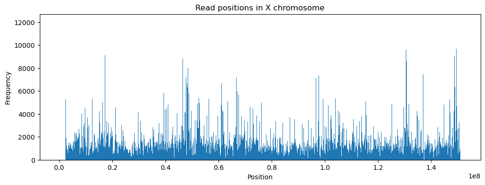
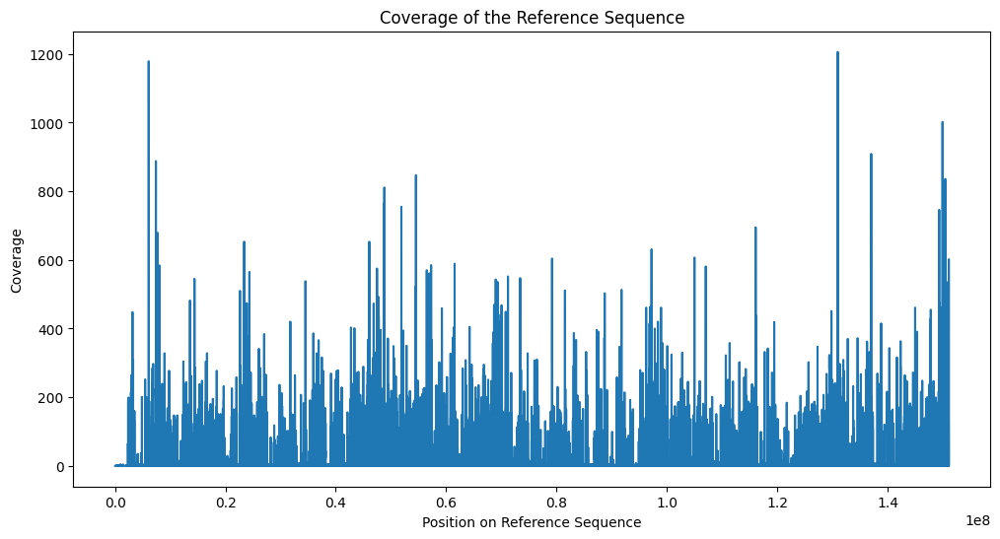
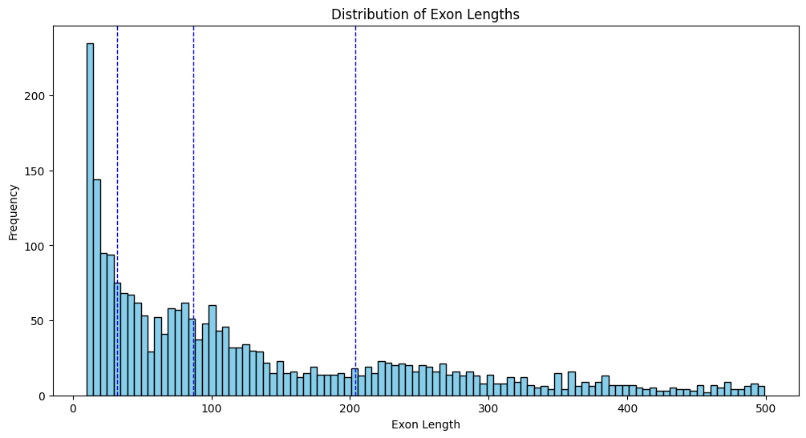

# Genomics
## Overview

This project specializes in the comprehensive analysis of the X chromosome. By leveraging a reference sequence, the Burrows-Wheeler Transform (BWT) of that sequence, and multiple reads, our code precisely aligns the reads to the optimal positions within the reference sequence. Following alignment, the project conducts an in-depth analysis to make sense of the data and provide valuable insights.

## Features

- Reference sequence alignment
- Burrows-Wheeler Transform (BWT) processing
- Read fitting and matching
- Post-fitting analysis

## Installation

To install the necessary dependencies, run:

```bash
pip install -r requirements.txt
```

## Usage

To run the analysis. Add your data in `gene_data` and use the following command:

```bash
python3 main.py --bwt gene_data/chrX_last_col.txt --map gene_data/chrX_map.txt --ref gene_data/chrX.fa --reads gene_data/reads --err_thresh 2 --save_path ../results.csv
```

## Results

Distribution of starting points of matched reads vs position:



Frequency of matches at a given position vs position in the reference sequence:



Coverage region of reads:



Coverage region of exons:


Positions of error (mismatch or insertion/deletion) vs position in the reference sequence:


Position of only mismatches vs position in the reference sequence:


Exon lengths:



Error distribution:

